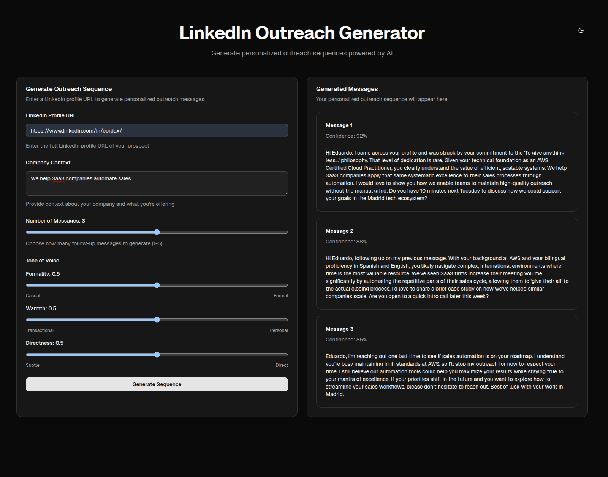
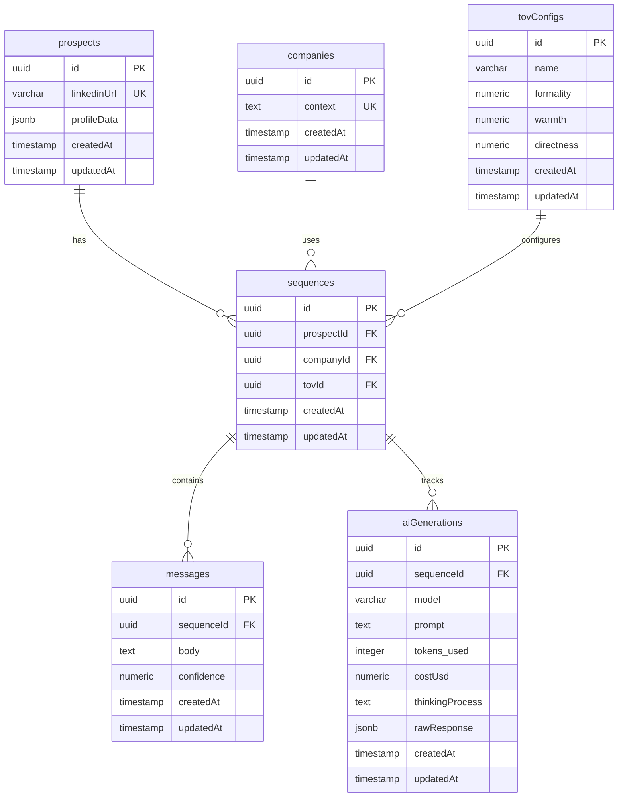

# LinkedIn Messaging Sequence Generator

AI-powered tool to generate personalized LinkedIn messaging sequences based on prospect profiles, company context, and tone-of-voice configurations.



## Tech Stack

- **Framework**: Next.js 16
- **Language**: TypeScript
- **Database**: Neon postgres with Drizzle ORM
- **API**: tRPC
- **AI**: Vercel AI SDK

## Features

- Extract LinkedIn prospect profiles
- Configurable tone-of-voice (formality, warmth, directness)
- AI-generated personalized message sequences
- Confidence scoring for each message
- Full AI generation tracking (model, tokens, cost, thinking process)

## Database Schema



## Getting Started

### Prerequisites

- Bun installed

### Installation

```bash
# Install dependencies
bun install

# Set up environment variables
cp .env.example .env

# Push database schema
bun run db:push

# Start development server
bun run dev
```

### Available Scripts

- `bun run dev` - Start development server with Turbo
- `bun run build` - Build for production
- `bun run start` - Start production server
- `bun run db:push` - Push schema changes to database
- `bun run db:studio` - Open Drizzle Studio

## Architecture & Design Decisions

### Database Schema Design

The schema uses a **normalized structure** with 6 core tables that separate concerns and enable data reusability.

**3NF Compliance**: The schema follows Third Normal Form principles:
- **No transitive dependencies**: Each non-key attribute depends only on the primary key
- **Atomic values**: All fields contain single values (complex data like profiles stored as JSONB blobs)
- **Separate entities**: Prospects, companies, and TOV configs are independent entities, not embedded in sequences
- **Benefits**: Eliminates data redundancy, ensures update consistency, and enables flexible querying
- **Example**: Company context is stored once in `companies` table and referenced by multiple sequences, rather than duplicated in each sequence record


### Prompt Engineering Approach

**Structured Prompt Architecture**
- System message: Defines AI role as expert sales copywriter with requirements (personalization, word count 50-150, clear CTA)
- User message: Formatted prospect data (experience, education, languages, certifications)
- **Why**: Clear separation of concerns - system sets behavior, user provides context

**TOV Translation Layer**
Converts numeric TOV values (0-1) into natural language instructions:
- **Formality**: <0.3 = casual/contractions, 0.3-0.7 = professional, >0.7 = formal
- **Warmth**: <0.3 = transactional, 0.3-0.7 = friendly, >0.7 = empathetic
- **Directness**: <0.3 = subtle/questions, 0.3-0.7 = tactful, >0.7 = explicit CTA
- **Why**: LLMs respond better to descriptive instructions than numeric values

**Progressive Sequence Strategy**
- Message 1: Initial outreach (value prop)
- Message 2+: Follow-ups (social proof, urgency)
- Final: Breakup email (polite close)
- **Why**: Mirrors proven sales patterns, gives AI clear structure

### AI Integration Patterns

**Service Layer Architecture**
- `AiService` class encapsulates all AI logic
- Interface-based design (`IAiService`) enables testing and future provider swaps
- **Why**: Decouples AI provider from business logic, making it easy to switch from Gemini to GPT-4 or Claude

**Structured Output with Zod**
```typescript
schema: z.object({
  messages: z.array(z.object({
    body: z.string().describe("...")
  })).length(input.messageCount)
})
```
- Guarantees consistent, type-safe AI responses
- Automatic validation prevents malformed outputs
- **Why**: Eliminates parsing errors and ensures predictable structure every time

**Post-Generation Validation Heuristic**
Confidence scoring based on message quality indicators:
- Name mention: +0.15
- Company mention: +0.2
- Role/title mention: +0.1
- Headline keyword matches: +0.1 (up to 3 words)
- Word count 50-150: +0.2 (30-200: +0.1)
- CTA presence: +0.25

**Error Handling & Cost Tracking**
- 3-retry logic for transient API failures with descriptive error context
- Cost calculation: (inputTokens / 1M × $0.10) + (outputTokens / 1M × $0.40)
- Stores metrics in database for analytics and budget monitoring

**Thinking Process Capture**
- Uses Gemini's `thinkingConfig` to capture AI reasoning
- Stores in `aiGenerations.thinkingProcess`
- **Why**: Invaluable for debugging unexpected outputs and understanding AI decisions

### API Design & Validation

**tRPC for Type Safety**
- End-to-end type safety from React components to database queries
- No manual API documentation needed - types are the contract
- **Why**: Eliminates runtime errors from API mismatches, refactoring is safe

**Input Validation with Zod**
```typescript
z.object({
  prospectUrl: z.string().url(),
  companyContext: z.string().min(1),
  ...
})
```
- Runtime validation at API boundaries
- Clear error messages for invalid inputs
- **Why**: Prevents invalid data from reaching business logic

**Service Layer Pattern**
- Business logic separated into services: `SequenceService`, `LinkedInService`, `AiService`


### Future Improvements/Changes

- Puppeteer/playwright based scraper with docker compose and railway deployment instead of vercel
- better service names
- better tov storage
- better heuristic for message quality
- additonal company config
- improve sqeuence abstraction
- add users
- add prompt caching
- overall refactors