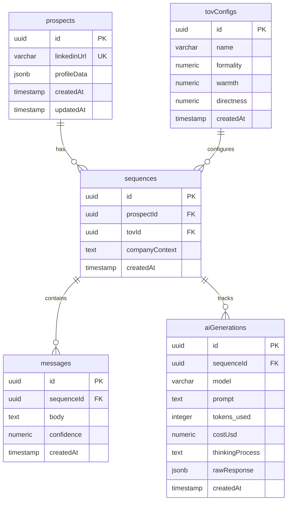

# LinkedIn Messaging Sequence Generator

## Database Schema

## Future Improvements/Changes

- Puppeteer/playwright based scraper with docker compose and railway deployment instead of vercel
- better UI
- better service names
- better tov storage
- additonal company config
- improve sqeuence abstraction